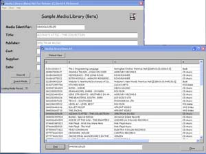

## Binary Search Tree Node Class \(database engine\)

### Description

Binary Search Tree Nodes Class - an effective and very fast searching/database storage methodology.

This is a self-contained binary tree class along with a non-gui listbox class to create, search and maintain

any unique key data in a binary tree. A lot of databases use this methodology as the basis for their

database engines. Now you can have the database power inside your application. For example,

a search of 3,000 keys will only require an average of 7-11 tree visits/seeks regardless of the

key your are trying to locate. Also included are member routines to output all the data keys in

tree in alpha order or even in reverse alpha order. This has been extensively tested for reliabilty

and fast response for searching, insertions, deletions and traversals of tree nodes in general.

Included root node release, tree re-balancing and garbage threshold detection and collection.

Also extensive notes and a built-in commented example project/form to build a couple of example

binary trees which output to a gui listbox. Also to demonstrate some of the class member functions

usage. You may be surprised to learn there is little emphasis on recursion so no worries of runaway

stack levels.(**IMPORTANT**: this latest version includes a major bug fix. When using the data index to reference external data, during a tree rebalance the data index was being lost or mixed up with another. It is a simple fix but significant to keeping the database integrity. This latest version is 1.1 and also includes the functions referenced in the supplemental article). ## LATEST: ## now includes a CD,DVD,Books Media Library application sample. ## (c) David K Richmond
 
### More Info
 
self contained

A basic understanding of Binary Tree Methods would be helpful but not essential. The class has examples to build and try.

Member functions have been tested so none as yet.

             |
---                |---
**Submitted On**   |2005-05-04 08:34:10
**By**             |[David K Richmond](https://github.com/Planet-Source-Code/PSCIndex/blob/master/ByAuthor/david-k-richmond.md)
**Level**          |Advanced
**User Rating**    |5.0 (45 globes from 9 users)
**Compatibility**  |VB 6\.0
**Category**       |[Databases/ Data Access/ DAO/ ADO](https://github.com/Planet-Source-Code/PSCIndex/blob/master/ByCategory/databases-data-access-dao-ado__1-6.md)
**World**          |[Visual Basic](https://github.com/Planet-Source-Code/PSCIndex/blob/master/ByWorld/visual-basic.md)
**Archive File**   |[Binary\_Sea188491552005\.zip](https://github.com/Planet-Source-Code/david-k-richmond-binary-search-tree-node-class-database-engine__1-60218/archive/master.zip)

